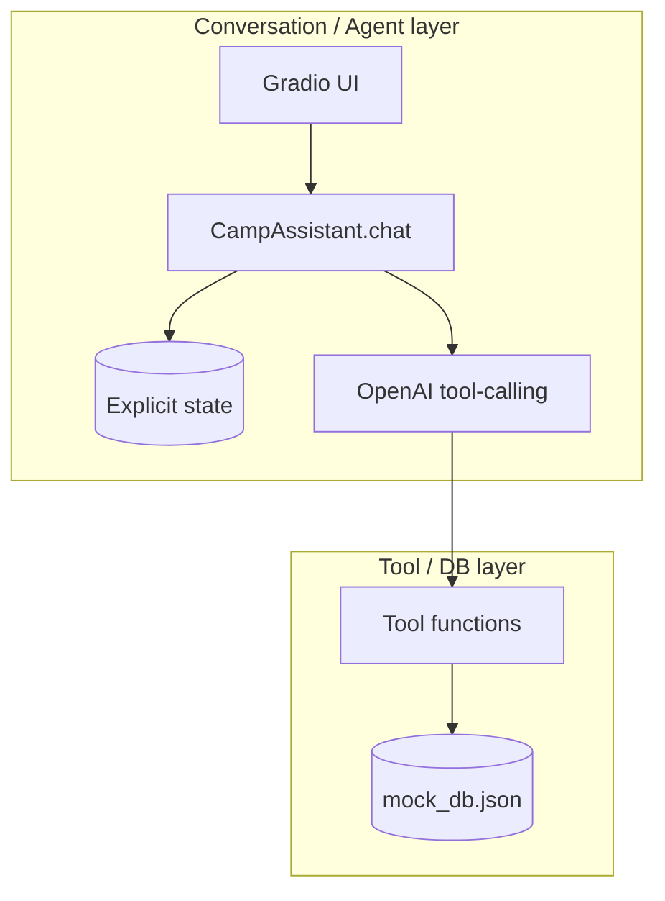
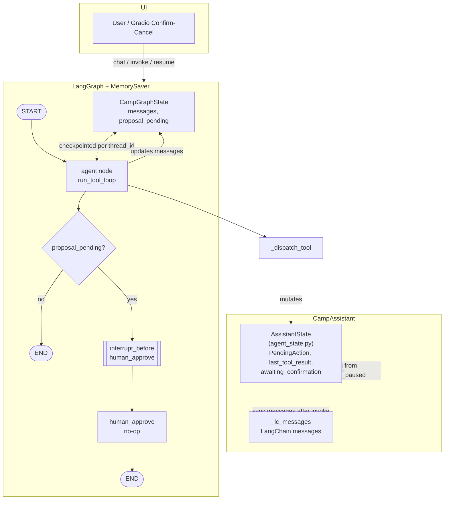

# Architecture

This note describes the current implementation of the summer camp registration assistant: how responsibilities are split, where validations live, how confirmation works, and how waitlist behavior is handled.

## System structure (two layers)

| Layer | Responsibility | Primary files |
| --- | --- | --- |
| **Tool / DB** | Load/save JSON, queries, **all** validations, structured success/error results, no natural language | `tool_schemas.py`, `tool_helpers.py`, `db_store.py` |
| **Conversation / Agent** | Multi-turn flow, LangChain `ChatOpenAI` + tools inside a LangGraph (`agent` → optional `human_approve` with `interrupt_before`), checkpoint resume + deterministic DB writes, text + Gradio Confirm/Cancel | `agent.py`, `agent_langchain.py`, `agent_langgraph.py`, `agent_state.py`, `guardrails.py` |

### LangGraph agent — current architecture (implemented)

`CampGraphState` in the graph holds only **`messages`** and **`proposal_pending`**. **`AssistantState`** lives on **`CampAssistant`** and is updated inside **`_dispatch_tool`** (e.g. `pending_action`). `awaiting_confirmation` on the assistant is aligned with **`graph_is_paused`** (paused before `human_approve`). That is **two** state stores that must stay coordinated.

## Deterministic code vs LLM

| Concern | Deterministic (Python) | LLM |
| --- | --- | --- |
| Age, capacity, cancelled camp, duplicate reg, schedule overlap | Yes | No |
| Parsing “Emma” when two kids match | Expose candidates from tools; **LLM asks user to pick** | Yes |
| Whether a write is allowed | Yes | No |
| When to ask for missing kid/camp/confirmation | Can be hybrid: LLM proposes next step; code enforces “no write without IDs + confirmation” | Yes for wording |
| Saving JSON after a valid write | Yes | No |

Principle: **tools return facts and error codes; the model turns them into user-facing sentences**, except validation itself never lives only in the prompt.

## Guardrails

| Guardrail | Where it lives |
| --- | --- |
| **1. Tool-based source of truth** | Reads only through `get_camps` / `get_kids` / `get_registrations` / `get_waitlist`; `SYSTEM_PROMPT` in `agent_langchain.py` tells the model not to invent facts. |
| **2. No guessing on ambiguity** | `tool_schemas.py` returns candidates (names + ids for tool use); chat copy uses names only; `user_message_for_tool_failure` nudges clarification in natural language without asking users for raw ids. |
| **3. Business rules in code** | Validations in `tool_helpers.py` / `tool_schemas.py`; `validate_propose_tool` rejects incomplete `propose_*` args; writes only via `register_kid` / `cancel_registration` / `update_registration_status` after confirmation. |
| **4. Safe failure behavior** | `_maybe_enrich_tool_error` in `agent.py` merges tool `message` with `user_message_for_tool_failure` for read-tool errors; model is told not to pretend success when tools fail. |
| **5. State consistency** | `can_execute_pending_write` in `guardrails.py` runs before any pending write in `_execute_pending_and_format`; incomplete `pending_action` or missing confirmation gate blocks execution. |

## Tool layer shape (contract)

- **Reads**: `get_camps`, `get_kids`, `get_registrations`, `get_waitlist` — may accept optional filters (e.g. by id, name substring); returns lists or single entities plus ambiguity metadata **you** define.
- **Writes**: `register_kid`, `cancel_registration`, `update_registration_status` — take explicit ids (or unambiguous resolution **before** call); return a structured result, e.g. `{ "success": bool, "error_code": str | null, "message": str, "details": object }`.
- **Order of validation** (defaults below): `camp_id` / `kid_id` / `registration_id` exist → camp `status == "open"` → age in `[min_age, max_age]` → not duplicate active registration → capacity (or waitlist policy) → schedule conflict vs other **active** registrations → status transition allowed (updates only).

Internal helpers (private): load DB, save DB, find camp(s) by name, find kid(s) by name, list overlapping camps by date/time for a kid.

## Agent: explicit state

The assistant should not rely on long chat history alone for transactional data. Keep a small state object on `CampAssistant` (reset when Gradio “Reset” creates a new instance).

Implemented in `agent_state.py` as `AssistantState` and `PendingAction`; `CampAssistant` holds `self.state` and `_messages` for the LLM transcript.

Current fields:

| Field | Purpose |
| --- | --- |
| `intent` | e.g. `None`, `"register"`, `"cancel"`, `"update_status"`, `"lookup"` |
| `selected_kid_id` / `selected_camp_id` | Resolved entities for the current flow |
| `selected_registration_id` | Resolved registration for cancel or status-change flows |
| `candidate_kids` / `candidate_camps` | When name search returns multiple matches |
| `awaiting_confirmation` | `True` when a write is summarized and user must confirm |
| `pending_action` | What would run after confirm: kind + payload (e.g. `kid_id`, `camp_id`, `registration_id`, target `status`) |
| `last_tool_result` | Most recent write-tool result; used for formatting and follow-up context |

`clear_confirmation()` clears `awaiting_confirmation` and `pending_action`. `reset_transaction_slots()` also clears selected ids and ambiguity candidates when a flow should be reset.

## Confirmation before writes

Mandatory for: create registration, cancel registration, update registration status.

1. Read tools establish kid/camp/registration facts.
2. Assistant **states** the planned change in one short summary.
3. Set `awaiting_confirmation=True` and store `pending_action`.
4. Only if the user’s reply matches the deterministic confirmation policy in `confirmation.py`, call the write tool with ids from `pending_action`.
5. On rejection (`no`, `cancel`, `stop`, `never mind`, etc.), clear `pending_action` without writing.
6. In the Gradio UI, the same flow is exposed both as typed replies and as **Confirm / Cancel** buttons.

Code should enforce: **no write tool invocation** unless `awaiting_confirmation` was satisfied (or you use a dedicated “execute” internal function that only runs after this gate).

## Runtime flow

1. Append user message to message list (for the model).
2. Run the LangGraph `agent` node, which calls the LLM and dispatches tools through `_dispatch_tool`.
3. Read tools return facts; `propose_*` tools validate input and only queue a `PendingAction`.
4. If a proposal succeeded, LangGraph pauses before `human_approve`, and `CampAssistant` sets `awaiting_confirmation=True`.
5. If the user confirms, `_execute_pending_and_format()` runs the real write tool, stores `last_tool_result`, clears confirmation state, and formats the final reply.
6. If the user rejects, the assistant clears confirmation state and returns a cancellation message without writing.

## Context window

Aligned with `README.md`: the assistant does **not** rely only on the full chat transcript. Long or trimmed history can drop details, so anything that must stay correct for registration is carried in **structured state** and **tool results**, not only in free text.

| Kind of information | Where it is kept |
| --- | --- |
| Which child or camp the flow is about | `AssistantState` (`selected_*` fields) and fresh reads from tools |
| Multiple name matches | Tool payloads (`AMBIGUOUS_*` with candidates); optional slots on state for follow-up |
| A queued write before the user says yes | `pending_action` + `awaiting_confirmation` on `CampAssistant` |
| Whether we are waiting on confirm vs normal chat | Same flags; aligned with LangGraph pause before approval when a proposal is pending |

Reads always go through tools against `mock_db.json`, so facts stay grounded even if the model forgets an earlier turn. The LLM still sees a growing message list (`_lc_messages` + LangGraph checkpoint `messages` per `thread_id`); **writes** remain gated on `pending_action` and deterministic checks, not on “the model remembers from chat alone.”

## Resolved defaults (grounded in `mock_db.json`)

These are the concrete choices in the current implementation.

### Error codes (`error_code`)

Use stable uppercase snake identifiers; messages can stay human-readable.

| Code | When |
| --- | --- |
| `NOT_FOUND` | No camp/kid/registration for the given id, or name search returned zero rows. |
| `AMBIGUOUS_KID` | Name search matches more than one kid (e.g. **Emma** → Emma Thompson `kid-1`, Emma Wilson `kid-3`). |
| `AMBIGUOUS_CAMP` | Name search matches more than one camp (none in the current seed file; still return this shape for robustness). |
| `CAMP_CANCELLED` | Camp `status` is `cancelled` (e.g. **Drama Club** `camp-5`). |
| `CAMP_FULL` | `enrolled >= capacity` when trying to promote `waitlisted -> confirmed` and no seat is free. |
| `AGE_RESTRICTION` | Kid `age` not in `[min_age, max_age]` (e.g. **Ethan Davis** 14 vs **Swimming Basics** 6–9). |
| `DUPLICATE_REGISTRATION` | Same `kid_id` + `camp_id` already has a registration in an **active** state (`pending`, `confirmed`, or `waitlisted`). |
| `SCHEDULE_CONFLICT` | Another **active** registration for this kid overlaps in date range and daily time window (see below). |
| `INVALID_STATUS` | Target status not in the allowed set for this operation. |
| `INVALID_TRANSITION` | Requested status change is not allowed from the current status. |
| `VALIDATION_ERROR` | Malformed input (missing id, bad date format) — use sparingly; prefer specific codes. |

Pytest names that mirror these codes (plus success/read paths) live in `tests/test_tool_layer.py`.

### Name matching (ambiguity)

- Normalize: strip whitespace, case-insensitive comparison.
- **Kid search:** match if the query is a **case-insensitive substring** of the kid’s full `name`, **or** equals the **first token** (first name) of `name`. Examples: `"Emma"` matches both Emmas; `"Emma Thompson"` should match only `kid-1` if exact full-name match wins — recommended rule: **exact full name match first** (single result); else **substring**; if multiple remain → `AMBIGUOUS_KID` with `details.candidates` (max **10** rows, DB has 10 kids so this is a safe cap).
- **Camp search:** same idea on camp `name` (seed data has unique camp names; substring still useful for “soccer” vs “Soccer Stars”).
- Return ambiguous results as structured candidates (ids + display names), never pick one silently.

### Schedule conflict

Treat a registration as **active** if `status` is one of: `pending`, `confirmed`, `waitlisted` (waitlisted still reserves the slot story — if you prefer waitlist to not block time, drop `waitlisted` here; default **include** `waitlisted` so behavior matches “already tied to that camp week”).

**Camp session:** `start_date`–`end_date` inclusive; daily hours from `time_slot` `"HH:MM-HH:MM"` (same hours each day in range).

**Conflict** between two camps A and B iff:

1. Date ranges overlap: `max(A.start, B.start) <= min(A.end, B.end)` (compare as dates).
2. Time intervals overlap on the same clock (assume same timezone): parse start/end minutes from `time_slot`, intervals overlap if `end_A > start_B` and `end_B > start_A` in the usual sense.

Example: **Soccer Stars** `camp-1` week of 2026-07-14–18, 09:00–12:00 and **Science Explorers** `camp-6` same week 09:00–12:00 → conflict for the same kid. That matches the **Schedule Conflict** scenario (Emma Thompson already on Soccer Stars; Science Explorers overlaps).

### Status values and transitions

Statuses supported by the system: `pending`, `confirmed`, `waitlisted`, `cancelled`.

**Registration** (`update_registration_status`):

| From | Allowed to |
| --- | --- |
| `pending` | `confirmed`, `cancelled` |
| `confirmed` | `cancelled` |
| `waitlisted` | `confirmed`, `cancelled` |
| `cancelled` | — (no further updates; use a dedicated rule or treat as terminal) |

**Cancel registration:** the implementation uses a dedicated `cancel_registration` that sets status to `cancelled`. If the previous status was `pending` or `confirmed`, it decrements `camp["enrolled"]`. The success payload may also include `released_spot`, `camp_id`, `enrolled_after`, and `capacity`.

**New registration** (`register_kid`): a created row is `pending` if the camp still has capacity, otherwise `waitlisted`. New signups do not create `confirmed` rows directly.

### Capacity and waitlist (v1)

- **Seed data:** **Art Adventure** `camp-2` has `enrolled: 12`, `capacity: 12` → full. **Science Explorers** `camp-6` has waitlisted `reg-6` for Sophia Lee.
- **When `enrolled >= capacity`:** `register_kid` creates a new row with **`status: waitlisted`** and does **not** increment `camp["enrolled"]`.
- **Promotion path:** after cancelling a `pending` or `confirmed` registration, `cancel_registration` may return `released_spot=True`. The agent can then call `get_waitlist(camp_id)` to inspect the FIFO queue and use `propose_update_registration_status(..., new_status="confirmed")` for the next waitlisted row.
- **Capacity check on promotion:** `update_registration_status` returns **`CAMP_FULL`** if a waitlisted registration is promoted while the camp is still full.

### Confirmation phrases (reference)

Accept as confirm: `yes`, `y`, `yeah`, `confirm`, `confirmed`, `go ahead`, `ok`, `okay`, `sure`, `please do`, `do it` (case-insensitive, normalized). Reject: `no`, `nope`, `wait`, `cancel`, `stop`, `don't`, `dont`, `abort`, `never mind`.

## Debug UI behavior

The Gradio app in `agent.py` includes a hidden confirmation panel. It becomes visible whenever `agent.state.awaiting_confirmation` is `True`.

- The assistant can be confirmed either by typing a confirmation phrase or by clicking the **Confirm** button.
- The user can reject the pending action either by typing a rejection phrase or by clicking **Cancel**.
- The button handlers call `confirm_pending_write()` and `reject_pending_write()`, which route through the same deterministic confirmation logic as the chat path.

## Privacy note

This prototype uses local mock data and focuses on tool correctness, confirmation-before-write, and conversation flow. Because the dataset includes child and parent contact details, a production version would also need stronger privacy and security controls such as authentication, authorization, secret management, audit logging, and careful handling of PII.

## File map (deliverable)

| File | Role |
| --- | --- |
| `tool_schemas.py` | DB access, validations, public tool API for the LLM |
| `tool_helpers.py` | Name matching, schedule conflict checks, status transition helpers |
| `guardrails.py` | Pending-write gate, propose-tool validation, user-facing hints for tool failures |
| `agent.py` | `CampAssistant`, state, `chat()` loop, tool routing, confirmation gate, Gradio UI |
| `agent_langchain.py` | System prompt, tool definitions, tool loop |
| `agent_state.py` | `AssistantState`, `PendingAction`, reset / clear helpers |
| `mock_db.json` | Data (do not commit secrets elsewhere) |
